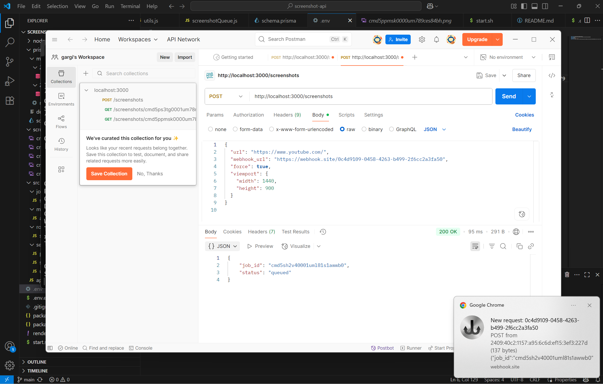
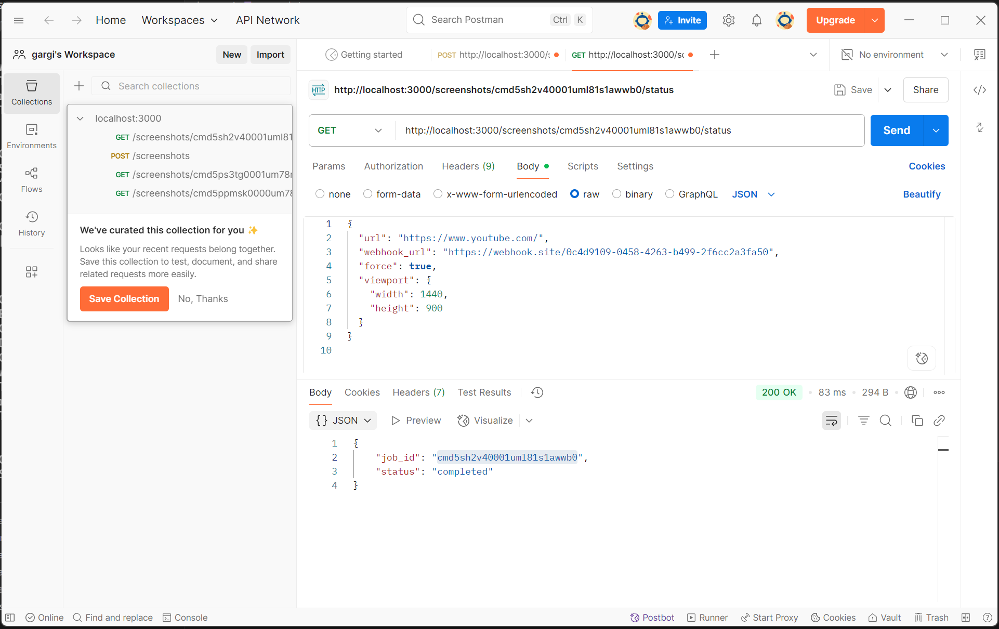

#  Screenshot API – Node.js + BullMQ + Prisma + Redis
A queue-based RESTful API to capture website screenshots asynchronously using Puppeteer, BullMQ, and Redis. It supports webhook notifications and job status tracking.

---

##  Features

- Queue-based screenshot processing with BullMQ
- Redis (Upstash or local) for job queue management
- Puppeteer for high-quality screenshots
- Prisma ORM with SQLite/PostgreSQL support
- Webhook notification on job completion
- RESTful API with Express

---

##  Tech Stack

- Node.js + Express
- BullMQ + Redis (Upstash-compatible)
- Prisma ORM + SQLite (local development)
- Puppeteer
- dotenv, axios, and other essential libraries

---

##  Project Structure

```
screenshot-api/
├── src/
│   ├── jobs/
│   │   └── screenshotQueue.js
│   ├── middlewares/
│   │   └── authMiddleware.js
│   ├── routes/
│   │   └── screenshotRoutes.js
│   ├── services/
│   │   ├── prismaClient.js
│   │   └── screenshotService.js
│   │   └── utils.js
│   └── app.js
├── screenshots/
│   └── generated images stored here
├── prisma/
│   └── schema.prisma
├── .env
├── package.json
└── README.md
```

---

##  Setup Instructions

### 1. Clone the Repository

```bash
git clone https://github.com/GargiMittal10/screenshot-api.git
cd screenshot-api
```

### 2. Install Dependencies

``` bash
npm install
```

### 3. Create `.env` File

Create a `.env` file in the root directory:

```env
PORT=3000
API_KEY=skimai_key
DATABASE_URL="file:./dev.db"
REDIS_HOST=trusted-cardinal-16699.upstash.io
REDIS_PORT=6379
REDIS_PASSWORD=AUE7AAIjcDExZjAwZjU5YTlhMTQ0NzczOTJiNjYxMDIxYTg1MzRiMHAxMA
```

### 4. Setup Prisma

```bash
npx prisma generate
npx prisma migrate dev --name init
```

---

##  Run Locally

```bash
node src/app.js
```

Server will start at: **http://localhost:3000**

---

##  API Endpoints

### 1. Create Screenshot Job

**POST** `http://localhost:3000/screenshots`
**Headers:**
```
x-api-key: your_api_key
```

**Body (JSON):**
```json
{
  "url": "https://example.com",
  "webhook_url": "https://webhook.site/your-custom-endpoint",
  "force": true,
  "viewport_width": 1200,
  "viewport_height": 800
}
```

**Response:**
```json
{
  "job_id": "12345",
  "status": "queued"
}
```

---

### 2. Get Job Status

**GET** `/:job_id/status`

**Example:**
```
GET http://localhost:3000/screenshots/cmd5ps3tg0001um78mj2jrj1c/status
```

**Response:**
```json
{
  "job_id": "12345",
  "status": "completed",
  "screenshot_url": "http://localhost:3000/screenshots/12345.png"
}
```

---

## Example Postman Usage

1. Set `x-api-key` in headers.
2. Send a `POST` request to `http://localhost:3000/screenshots` with JSON body.
3. Poll `/status/:job_id` or set a `webhook_url` to receive the screenshot.

---

## Example Screeenshots for Reference




---

## Notes

- Use Upstash Redis (free tier) for cloud setup.
- Webhooks are optional but recommended for production.
- Screenshots are stored in `screenshots/` folder.

---

##  License

MIT © 2025

